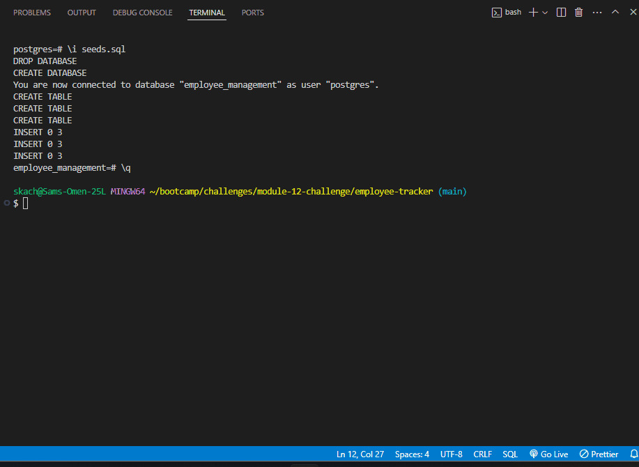

Employee Tracker
================

Description
-----------

The Employee Tracker is a command-line application designed to help manage a company's employee database. It allows users to view and manage departments, roles, and employees within the company. This tool was created to streamline the process of tracking employee information and organizational structure, making it easier for managers and HR personnel to keep records up-to-date.

-   **Motivation**: The project was motivated by the need for a more efficient way to manage employee data and organizational hierarchy. Traditional methods were often cumbersome and inefficient.
-   **Purpose**: This application was built to provide a user-friendly command-line interface for managing employee data, replacing manual record-keeping systems.
-   **Problem Solved**: It solves the problem of managing employee information and roles by providing an easy-to-use interface for viewing and updating records.
-   **Learning Outcomes**: Through this project, I learned how to integrate SQL databases with Node.js applications, manage database relationships, and use command-line interfaces for data management.

Table of Contents
-----------------

-   [Installation](#installation)
-   [Usage](#usage)
-   [Credits](#credits)
-   [License](#license)

Installation
------------

1.  **Clone the Repository**:

    ```bash
    `git clone <repository-url>`
2.  **Navigate to the Project Directory**:

    ```bash
    `cd employee-tracker`
3.  **Install Dependencies**:

    ```bash
    `npm install`
4.  **Set Up the Database**:

    -   Ensure PostgreSQL is installed and running.
    -   Create the database using the SQL script provided.
    -   Configure the database connection in `connection.js` file.

Usage
-----

1.  **Start the Application**:

    ```bash
    `npm start`
    ```
2.  **Follow the Prompts**:

    -   You will be prompted to choose actions such as viewing all departments, adding a new employee, or updating an employee's role.
    -   Follow the prompts to interact with the database.
3.  **Demo Video**:

    

Credits
-------

-   **Developer**: [Sam Kachergius](https://github.com/your-github-profile)
-   **Database**: PostgreSQL
-   **CLI Library**: [Inquirer.js](https://www.npmjs.com/package/inquirer)
-   **Tutorials**: Various tutorials and documentation on Node.js and PostgreSQL

License
-------

This project is licensed under the MIT License.

* * * * *

Badges
------


Features
--------

-   View all departments, roles, and employees
-   Add new departments, roles, and employees
-   Update employee roles

How to Contribute
-----------------

1.  **Fork the Repository**: Create a copy of the repository on your GitHub account.
2.  **Create a New Branch**:

    bash

    Copy code

    `git checkout -b feature-branch`

3.  **Make Changes**: Implement your changes and test them thoroughly.
4.  **Submit a Pull Request**: Push your changes and create a pull request to merge them into the main repository.